# Wazuh-SIEM-SOC-Lab
The project demonstrates deployment of a Wazuh manager on Linux, onboarding of Windows and Linux agents, file integrity monitoring (FIM), vulnerability detection, Linux command monitoring with Auditd, suspicious file analysis through VirusTotal integration, and Windows process telemetry using Sysmon. 

## Objectives
- Deploy a working Wazuh SIEM lab with one Linux server and monitored Windows/Linux endpoints.
- Validate log collection and alert generation for multiple host-based detection use cases.
- Implement basic detection engineering by adding custom rules and integrating external intelligence.

## Table of Contents

- [Scope](#scope)
- [Tools and Components Used](#tools-and-components-used)
- [Architecture Diagram](#architecture-diagram)
- [Lab Environment](#lab-environment)
- [Use-Case Summary](#use-case-summary)
- [Implementation](#implementation)

## Scope
- Install Wazuh Manager and Dashboard on a Linux server.
- Deploy Wazuh agents to one Windows endpoint and one Linux endpoint.
- Enable and validate File Integrity Monitoring (FIM).
- Configure and test Vulnerability Detection.
- Configure Auditd monitoring for Linux command execution visibility.
- Integrate Sysmon logs from Windows endpoints into Wazuh.
- Integrate VirusTotal for malicious file reputation analysis.
- Create custom detection rules for specific security events.
- Map detections to relevant MITRE ATT&CK techniques.

## Tools and Components Used
- Wazuh SIEM / Wazuh Dashboard / Wazuh Agents
- Linux server and Linux endpoint
- Windows endpoint
- Auditd for Linux command logging
- Sysmon for Windows event telemetry
- VirusTotal integration for file reputation enrichment
- EICAR file for safe malware test simulation

## Architecture Diagram
The following diagram is added to show the relationship between the Wazuh manager, endpoint agents, telemetry sources, and the VirusTotal integration. It also visually identifies where the project’s monitored test scenarios occur.
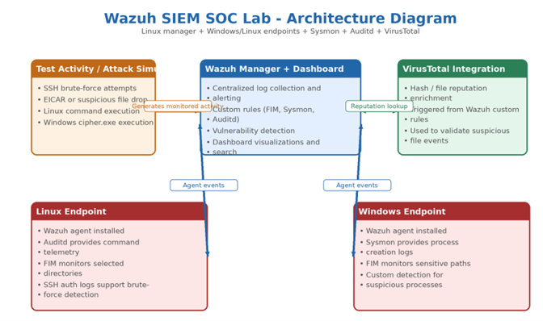

## Lab Environment
| Component | Role | Operating System | Notes |
|-----------|------|------------------|-------|
| Wazuh Manager / Dashboard | Centralized logging, rules, dashboards | Linux Server | Installed using the official quickstart script |
| Linux Endpoint | Monitored endpoint | Ubuntu 24 LTS | Wazuh agent + Auditd + FIM |
| Windows Endpoint | Monitored endpoint | Windows 11 | Wazuh agent + Sysmon + FIM |
| VirusTotal | External enrichment | Cloud service | Used to check suspicious files triggered by custom rules |

## Use-Case Summary
| Use Case | Primary Data Source | Platform | Detection Goal | Validation Method |
|-----------|-------------------|----------|----------------|------------------|
| File Integrity Monitoring (FIM) | Wazuh Syscheck / FIM | Linux & Windows | Detect monitored file creation, modification, and deletion | Create, modify, and delete test files in monitored directories |
| Vulnerability Detection | Wazuh Vulnerability Module | Linux & Windows | Identify vulnerable packages and CVEs | Review vulnerability dashboard after inventory synchronization |
| Linux Command Monitoring | Auditd logs forwarded via Wazuh agent | Linux | Detect suspicious or sensitive command execution | Execute sample commands and validate resulting alerts |
| Suspicious File Reputation Check | FIM + VirusTotal Integration | Linux | Enrich file events with reputation and malware indicators | Place EICAR test file and confirm enrichment event |
| Windows Process Monitoring | Sysmon Events ingested by Wazuh | Windows | Detect suspicious process launches using custom rules | Run cipher.exe and validate Wazuh alert |
| SSH Brute-Force Detection / Blocking | SSH authentication logs | Linux | Detect repeated failed login activity and support response actions | Generate failed SSH attempts and confirm alerts or blocking events |


# Implementation:
## 1. Wazuh Installation on Linux Server

The Wazuh platform was installed on a Linux server using the official Wazuh Quickstart installer.

### Installation Command

```bash
curl -sO https://packages.wazuh.com/4.14/wazuh-install.sh && sudo bash ./wazuh-install.sh -a
```

### Installation

The official installation script was executed to deploy the Wazuh Manager, Indexer, and Dashboard components.

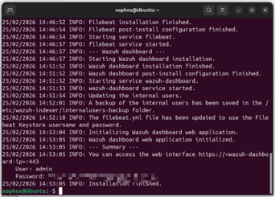

After installation, the dashboard can be accessed through HTTPS on the server address using the administrator credentials generated during the installation process.

Navigate to:

```text
https://<server-ip>:443
```

Enter the administrator credentials to access the Wazuh Dashboard.

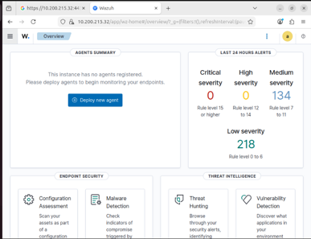

---

## 2. Agent Deployment

### Linux Endpoint

To deploy the Wazuh agent on a Linux endpoint:

1. Navigate to **Deploy New Agent** in the Wazuh Dashboard.
2. Select **DEB amd64** for Ubuntu 24 LTS (or the appropriate package for your Linux distribution).

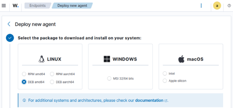

3. Fill in the required endpoint information.
4. Copy the generated installation command and execute it on the Linux endpoint.
5. Copy the generated service start command and execute it on the endpoint to register the agent with the Wazuh Manager.

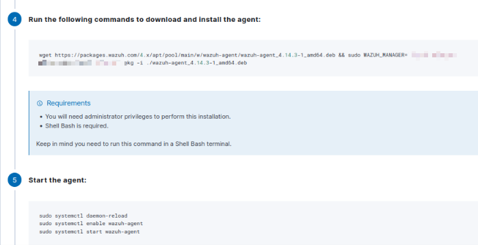

### Windows Endpoint

To deploy the Wazuh agent on a Windows endpoint:

1. Navigate to **Deploy New Agent** in the Wazuh Dashboard.
2. Select the **Windows MSI** installation option.
3. Specify the Wazuh Manager address.
4. Copy and execute the generated installation command.
5. Start the Wazuh agent service using the generated PowerShell command.

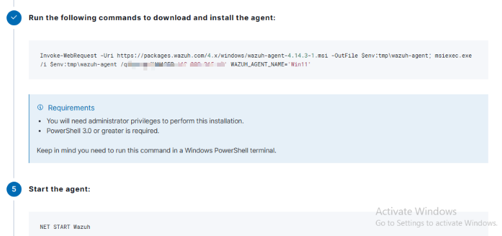

### Validation

After successfully deploying the agents, both Linux and Windows endpoints should appear in the Wazuh Dashboard and report to the Wazuh Manager.

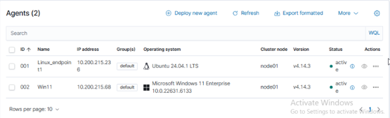

```
```
## 3. File Integrity Monitoring (FIM)

File Integrity Monitoring (FIM) was configured to detect file creation, modification, and deletion events on monitored directories across endpoint systems.

### Configure Wazuh Manager

To ensure complete event visibility, the `logall` and `logall_json` options were enabled in the Wazuh Manager configuration file.

Configuration file location:

```text
/var/ossec/etc/ossec.conf
```

Under the `<global>` section, modify the following parameters:

```xml
<logall>yes</logall>
<logall_json>yes</logall_json>
```

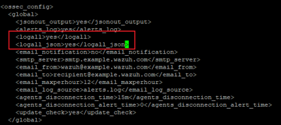

After saving the changes, restart the Wazuh Manager service.

---

### Configure Endpoint Monitoring

Verify that File Integrity Monitoring is enabled on the endpoint agent.

Add the following configuration within the FIM directories section to monitor all file changes:

```xml
<directories check_all="yes" report_changes="yes">/root</directories>
```

This configuration enables monitoring of file creation, modification, deletion, ownership changes, permissions changes, and content changes.

#### Windows Agent Configuration

Configuration file location:

```text
C:\Program Files (x86)\ossec-agent\ossec.conf
```

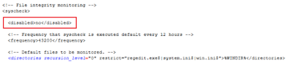

#### Linux Agent Configuration

Configuration file location:

```text
/var/ossec/etc/ossec.conf
```

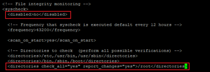

After making the changes, restart the Wazuh agent service on each endpoint.

---

### Validation

To validate File Integrity Monitoring:

1. Create a test file in the monitored directory.
2. Modify the file contents.
3. Delete the file.
4. Observe the generated events in the Wazuh Dashboard.

The dashboard should display alerts corresponding to each file operation performed on the monitored directory.

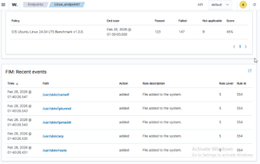

## 4. Vulnerability Detection

Wazuh Vulnerability Detection was configured to identify vulnerable software packages and associated CVEs across monitored endpoints.

### Configuration for Older Wazuh Versions

In older versions of Wazuh, vulnerability detection must be manually enabled through the Wazuh Manager configuration file.

Initial configuration steps are shown below:

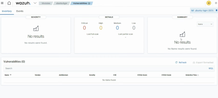

Open the Wazuh Manager configuration file:

```text id="8sxr3n"
/var/ossec/etc/ossec.conf
```

Modify the vulnerability detection configuration as required.

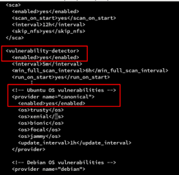

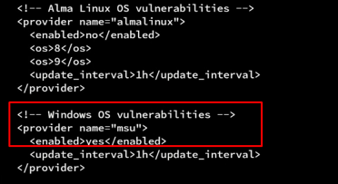

After saving the configuration changes, restart the Wazuh services to apply the new settings.

Once synchronization completes, vulnerability information becomes available within the Wazuh Dashboard.

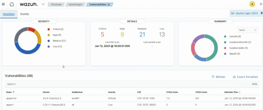

---

### Wazuh 4.14 and Later

In Wazuh version 4.14 and newer releases, Vulnerability Detection is enabled by default and no additional configuration is required.

A dedicated **Vulnerabilities** section is available within the dashboard, allowing security analysts to:

* View detected CVEs
* Review affected assets
* Assess vulnerability severity
* Track remediation status

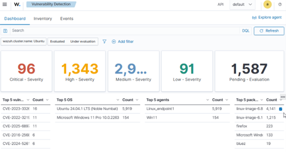

---

### Validation

Validation was performed by reviewing the Vulnerability Detection dashboard after endpoint inventory synchronization.

The dashboard successfully identified vulnerable software packages and mapped them to their corresponding CVEs, providing visibility into the security posture of monitored systems.

## 5. Linux Command Monitoring with Auditd

This use case demonstrates how Auditd was integrated with Wazuh to monitor command execution on Linux endpoints.

### Overview

Auditd (Audit Daemon) is a Linux service that records security-related events generated by the operating system. It is part of the Linux Auditing System and collects audit messages from the Linux kernel, storing them in log files for analysis.

Auditd can be used to:

* Monitor system calls
* Track file access and modifications
* Record user activities
* Monitor authentication events
* Log command execution

Audit logs are typically stored at:

```text id="tdl2m5"
/var/log/audit/audit.log
```

---

### Install Auditd

Install Auditd on the Linux endpoint.

After installation, verify that audit logs are being written to:

```text id="pwh4i8"
/var/log/audit/audit.log
```

---

### Configure Wazuh Agent

To allow Wazuh to ingest Auditd events, add the audit log file to the Wazuh agent configuration.

Open the Wazuh agent configuration file:

```text id="jlwmjh"
/var/ossec/etc/ossec.conf
```

Add the Auditd log file under the appropriate configuration section.

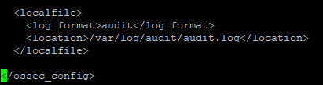

Save the file and restart the Wazuh agent.

---

### Configure Audit Rules

To capture command execution events, modify the Auditd rules file:

```text id="ktfp3f"
/etc/audit/rules.d/audit.rules
```

For this project, Auditd was configured to monitor commands executed by the root user.

Example rule configuration:

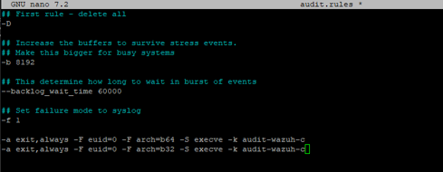

Save the file after making the changes.

Apply the new audit rules:

```bash id="yzqlc0"
auditctl -R /etc/audit/audit.rules
```

---

### Validation

To validate the configuration, execute commands on the Linux endpoint.

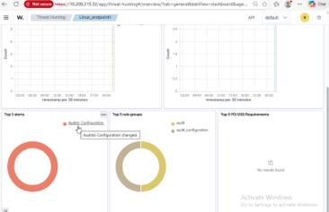

The generated Auditd events are forwarded to Wazuh and become visible within the Wazuh Dashboard.

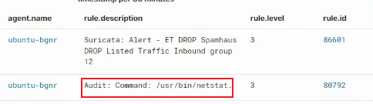

---

### Result

Wazuh successfully collected and displayed Auditd events from the Linux endpoint, providing visibility into command execution activity and supporting threat detection and investigation use cases.

## 6. VirusTotal Integration

This use case combines File Integrity Monitoring (FIM), custom Wazuh detection rules, and VirusTotal integration to enrich suspicious file activity with threat intelligence.

An EICAR test file was used as a safe malware simulation to validate the detection workflow.

### Verify File Integrity Monitoring

Before configuring VirusTotal integration, ensure that File Integrity Monitoring (FIM) is enabled on the endpoint.

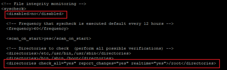

---

### Create a Custom Detection Rule

Navigate to:

```text
Wazuh Dashboard → Server Management → Rules → Manage Rules
```

Locate and edit the `local_rules.xml` file.

The `local_rules.xml` file is used to create custom detection rules that extend the default Wazuh rule set.

Add the required custom rule configuration:

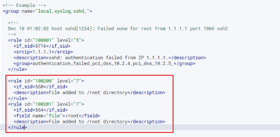

In this configuration:

* Rule IDs **550** and **554** are associated with File Integrity Monitoring events.
* The custom rule generates an alert when a monitored file event occurs.
* The rule description becomes the alert message displayed in the Wazuh Dashboard.

After saving the changes, reload the Wazuh Manager configuration.

---

### Configure VirusTotal Integration

Open the Wazuh Manager configuration file:

```text
/var/ossec/etc/ossec.conf
```

Add the VirusTotal integration configuration.

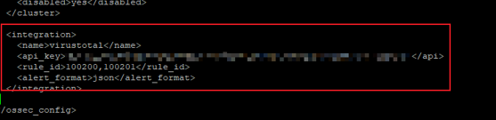

The VirusTotal API key can be obtained from:

```text
VirusTotal → User Profile → API Key
```

Ensure that the `rule_id` specified in the integration configuration matches the custom rule ID configured in `local_rules.xml`.

After saving the configuration, restart or reload the Wazuh Manager.

---

### Validation Using EICAR Test File

To validate the integration, download and place the EICAR test file on the monitored Linux endpoint.

The EICAR file is a harmless test file designed to simulate malware detection without introducing actual malicious content.

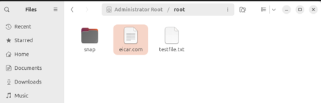

When the file is created on the monitored endpoint:

1. File Integrity Monitoring detects the file activity.
2. The custom Wazuh rule generates an alert.
3. The VirusTotal integration automatically submits the file hash for reputation analysis.
4. The resulting reputation information is appended to the Wazuh alert.

---

### Detection Results

The generated events can be reviewed in the Wazuh Dashboard.

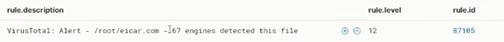

---

### Result

The VirusTotal integration successfully enriched File Integrity Monitoring alerts with external threat intelligence data. This provides additional context during investigations and helps analysts quickly determine whether a file is known to be malicious or suspicious.

The generated alert can be viewed in the Wazuh Dashboard.


## 7. Sysmon + Windows Process Monitoring

Sysmon was installed on the Windows endpoint and integrated with Wazuh to provide enhanced process and event monitoring. A custom detection rule was created to generate alerts when `cipher.exe` is executed.

### Install and Configure Sysmon

Download Sysmon from Microsoft and extract it to the `C:\` drive.

Download the Sysmon configuration file and install Sysmon using PowerShell.

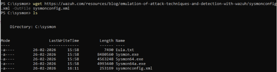

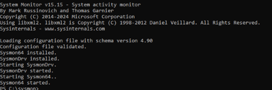

Verify Sysmon is generating events in:

```text
Applications and Services Logs → Microsoft → Windows → Sysmon → Operational
```

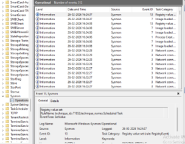

### Configure Wazuh to Collect Sysmon Logs

Edit the Wazuh agent configuration file:

```text
C:\Program Files (x86)\ossec-agent\ossec.conf
```

Add the Sysmon Operational log source and restart the Wazuh service.

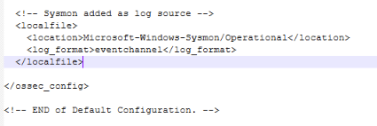

After restarting the service, Sysmon events should be visible in the Wazuh Dashboard.

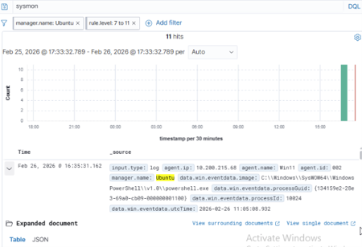

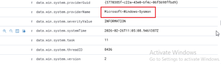

### Custom Detection Rule

A custom rule was created to detect execution of `cipher.exe` using Sysmon Process Creation events.

Review the existing Sysmon rules in Wazuh:

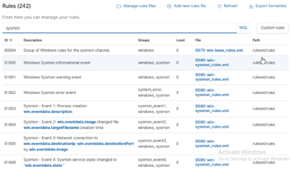

Identify the parent Sysmon Process Creation rule:

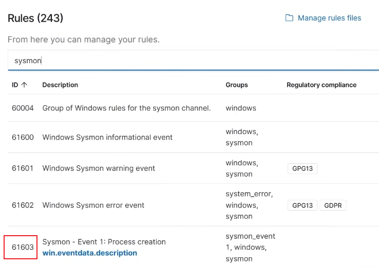

Create a custom rule matching `cipher.exe` execution.

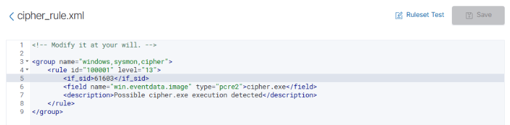

Restart the Wazuh Manager after saving the rule.

### Validation

Execute `cipher.exe` on the Windows endpoint using PowerShell.

The custom rule successfully generated an alert in the Wazuh Dashboard.

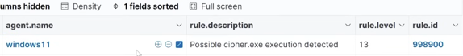

### Result
Wazuh successfully ingested Sysmon telemetry and generated custom alerts for suspicious process execution events.


## MITRE ATT&CK Mapping

The following table maps the implemented detection use cases to relevant MITRE ATT&CK tactics and techniques.

| Detection Scenario                        | ATT&CK Tactic       | Technique (ID)                                            | Rationale                                                                                                               |
| ----------------------------------------- | ------------------- | --------------------------------------------------------- | ----------------------------------------------------------------------------------------------------------------------- |
| SSH Brute-Force Detection                 | Credential Access   | Brute Force (T1110)                                       | Repeated failed SSH login attempts indicate password guessing activity against a remote service.                        |
| Linux Command Monitoring                  | Execution           | Command and Scripting Interpreter: Unix Shell (T1059.004) | Auditd monitoring provides visibility into shell command execution on Linux systems.                                    |
| Suspicious File Detection with VirusTotal | Command and Control | Ingress Tool Transfer (T1105)                             | Detection of newly introduced files combined with reputation analysis may indicate tool or payload delivery.            |
| File Deletion Monitoring (FIM)            | Defense Evasion     | Indicator Removal: File Deletion (T1070.004)              | Monitoring file deletion activity can help identify attempts to remove evidence or malicious artifacts.                 |
| Cipher.exe Process Detection              | Defense Evasion     | System Binary Proxy Execution (T1218)                     | Detection of Windows built-in binaries that may be abused as Living-off-the-Land Binaries (LOLBins).                    |


## Alert Analysis

### File Integrity Monitoring (FIM)

* Identify the affected file, host, and user context.
* Determine whether the change was expected or unauthorized.
* Investigate modifications involving startup locations, security tools, or unknown files.

### Vulnerability Detection

* Review the affected software and associated CVEs.
* Prioritize critical and internet-facing vulnerabilities.
* Track remediation status and verify patch deployment.

### Linux Command Monitoring

* Review the executed command, user account, and execution time.
* Determine whether the activity is administrative or suspicious.
* Investigate related commands for signs of persistence or malicious activity.

### VirusTotal-Enriched File Alert

* Verify the file path, hash, and VirusTotal reputation results.
* Determine whether the file was intentionally introduced or potentially malicious.
* Escalate and investigate further if the activity is unexpected.

### Sysmon Process Creation Alert (cipher.exe)

* Review the process command line, parent process, and user context.
* Validate whether execution was legitimate or suspicious.
* Investigate related process and file activity for additional indicators.

### SSH Brute-Force Detection

* Identify the source IP address and number of failed login attempts.
* Check for any successful authentication following the failed attempts.
* Block or restrict the source and escalate if compromise is suspected.
